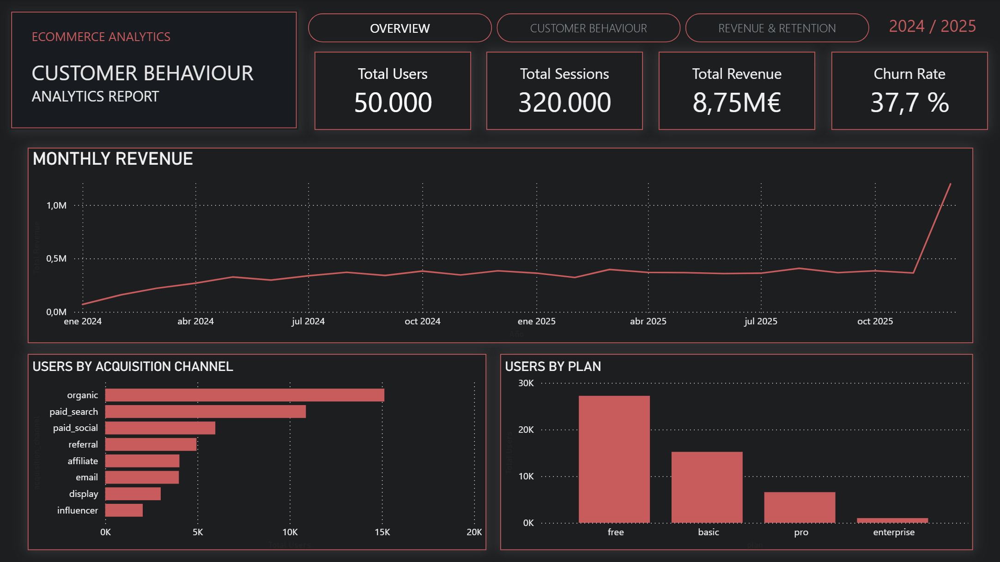
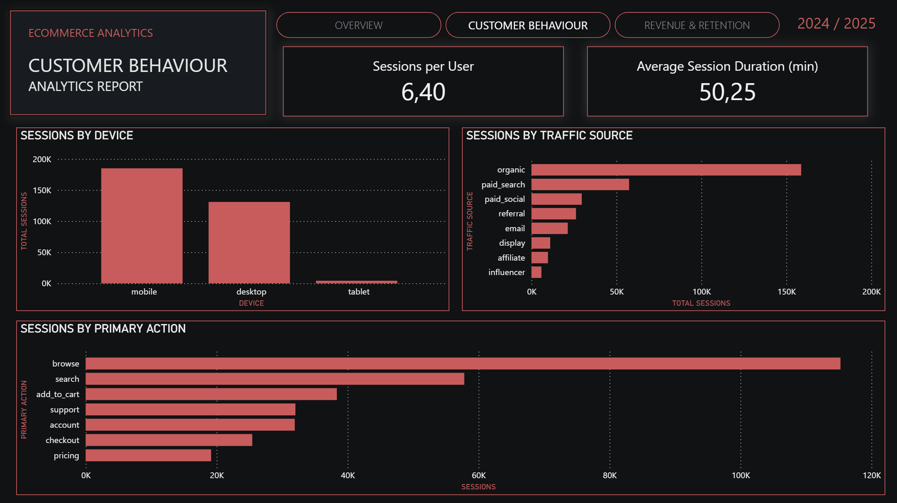
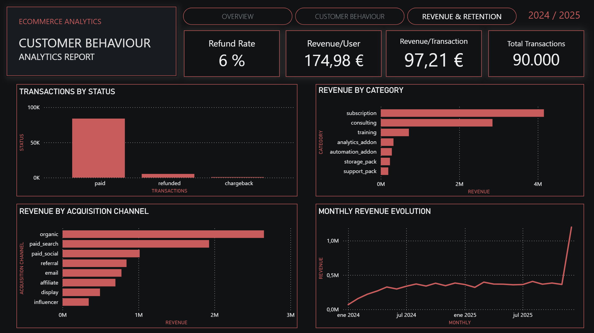

# Customer Behavior Analytics

## Project Overview

This project analyzes the behavior of users from a subscription-based digital platform using Python and Power BI.

The main goal is to understand how users interact with the platform, how activity and revenue evolve, and how customer retention changes over time.

The project follows a complete data analysis workflow, from the initial exploration and preparation of the data to the creation of metrics, exploratory analysis and an interactive Power BI dashboard.

The analysis covers:

- User activity and engagement
- Sessions and website behavior
- Revenue and transactions
- Customer churn
- Customer retention
- Cohort analysis
- Customer acquisition
- Revenue by category

---

## Business Questions

The project explores different questions related to customer behavior:

- How many users and sessions does the platform have?
- How active are users on the platform?
- How is revenue distributed and how does it change over time?
- Which acquisition channels have the most users?
- Which plans have the most users?
- Which devices and traffic sources generate the most sessions?
- What are the most common user actions?
- What percentage of users churn?
- What percentage of transactions are refunded?
- How is revenue distributed across categories?
- How does customer retention change over time?

---

## Dataset

The project uses three main datasets:

| Dataset | Rows | Description |
|---|---:|---|
| **users.csv** | 50,000 | User information, registration, plan and churn status |
| **sessions.csv** | 320,000 | User sessions and platform activity |
| **transactions.csv** | 90,000 | Transactions, revenue and payment information |

A separate `data_dictionary.csv` file is also included as documentation for the datasets and their columns.

---

## Technologies Used

### Data Analysis

- **Python**
- **Pandas**
- **NumPy**
- **Matplotlib**
- **Jupyter Notebook**
- **VS Code**

### Business Intelligence

- **Power BI Desktop**
- **Power Query**
- **DAX**

### Version Control

- **Git**
- **GitHub**

---

## Data Analysis

The first part of the project focuses on exploratory data analysis using Python.

### 1. Initial Data Exploration

The first notebook explores the structure and quality of the datasets.

The analysis includes:

- Number of rows and columns
- Data types
- Missing values
- Variable distributions
- User characteristics
- Initial activity patterns

**Notebook:** `01_eda_baseline.ipynb`

---

### 2. User Metrics

The second notebook analyzes user activity and engagement.

The analysis includes:

- Sessions per user
- User activity distribution
- Sessions by plan
- Session duration
- Daily activity

**Notebook:** `02_user_metrics.ipynb`

---

### 3. Revenue Analysis

The third notebook focuses on transactions and revenue.

The analysis includes:

- Revenue distribution
- Revenue per user
- Revenue evolution over time
- Transaction behavior

**Notebook:** `03_revenue_analysis.ipynb`

---

### 4. Cohort Retention Analysis

The fourth notebook analyzes customer retention over time.

Users are grouped into cohorts based on their registration month. Their activity is then analyzed during the following months.

The analysis includes:

- User signup month
- Session month
- Months since signup
- Active users by cohort
- Retention by cohort

A heatmap is used to visualize retention over time.

**Notebook:** `04_cohort_retention.ipynb`

---

### 5. Insights and Conclusions

The final notebook summarizes the main patterns found during the analysis.

It covers:

- User activity
- Engagement
- Revenue
- Churn
- Retention
- Cohort behavior

**Notebook:** `05_insights_conclusions.ipynb`

---

# Power BI Dashboard

The second part of the project uses Power BI to create an interactive dashboard based on the same datasets.

The dashboard is divided into three pages:

1. **Overview**
2. **Customer Behaviour**
3. **Revenue & Retention**

---

## Dashboard KPIs

The main KPIs include:

| KPI | Value |
|---|---:|
| Total Users | 50,000 |
| Total Sessions | 320,000 |
| Net Revenue | €8,749,142.26 |
| Churn Rate | 37.7% |
| Sessions per User | 6.40 |
| Average Session Duration | 50.25 min |
| Total Transactions | 90,000 |
| Refund Rate | ~6.0% |
| Revenue per User | €174.98 |
| Revenue per Transaction | €97.21 |

---

## Dashboard Pages

### Overview

The Overview page provides a general view of the platform.

It includes:

- Total users
- Total sessions
- Net revenue
- Churn rate
- Monthly revenue evolution
- Users by acquisition channel
- Users by plan



---

### Customer Behaviour

This page focuses on how users interact with the platform.

It analyzes sessions by:

- Device
- Traffic source
- Primary action

It also includes:

- Sessions per user
- Average session duration



---

### Revenue & Retention

This page focuses on transactions, revenue and customer retention.

It includes:

- Transactions by status
- Revenue by category
- Revenue by acquisition channel
- Monthly revenue evolution

It also includes KPIs related to refunds, transactions and revenue per user.



---

## Data Model

The Power BI model connects the `users` table with the two activity tables:

```text
users
  │
  ├── 1 : * ── sessions
  │
  └── 1 : * ── transactions

Both sessions and transactions are connected to users through user_id.

There is no direct relationship between sessions and transactions.

Key Findings

The analysis shows several relevant patterns:

Users have different levels of activity on the platform.
Mobile devices account for the largest share of sessions.
Organic traffic is the main traffic source.
Browsing is the most common primary user action.
The Free plan has the largest number of users.
Subscription is the largest revenue category.
Revenue shows a significant increase in December 2025.
Around 6% of transactions are marked as refunded.
User activity and revenue are not evenly distributed across all users.

These findings describe patterns observed in the available data. Further analysis would be required to understand the reasons behind these patterns or establish causal relationships.

Recommendations

The analysis suggests several areas that could be explored further:

Improve onboarding and analyze user behavior during the first months after signup.
Investigate the reasons behind customer churn.
Study the characteristics of highly active users.
Analyze the relationship between user activity and revenue.
Explore customer retention by acquisition channel and plan.
Investigate the large revenue increase observed in December 2025.

These recommendations are starting points for further analysis and should not be considered as confirmed causal conclusions.

Limitations

This project mainly focuses on descriptive analysis.

Some questions would require additional data or more detailed analysis, such as:

Conversion rate
Customer Lifetime Value (CLV)
Detailed customer segmentation
Marketing campaign performance
More detailed churn analysis
Retention by acquisition channel
Revenue forecasting

customer_behavior_analytics/
│
├── data/
│
├── docs/
│
├── notebooks/
│   ├── 01_eda_baseline.ipynb
│   ├── 02_user_metrics.ipynb
│   ├── 03_revenue_analysis.ipynb
│   ├── 04_cohort_retention.ipynb
│   └── 05_insights_conclusions.ipynb
│
├── screenshots/
│   ├── OVERVIEW.png
│   ├── CUSTOMER_BEHAVIOUR.png
│   └── REVENUE_&_RETENTION.png
│
├── reports/
│
├── src/
├── tests/
│
├── .gitignore
├── .python-version
├── main.py
├── pyproject.toml
├── README.md
├── requirements.txt
└── uv.lock

The Power BI .pbix are not included in the public repository.

Author

Alejandro Morillas Torres

Junior Data Analyst Portfolio

Tools: Python · SQL · Power BI · Excel